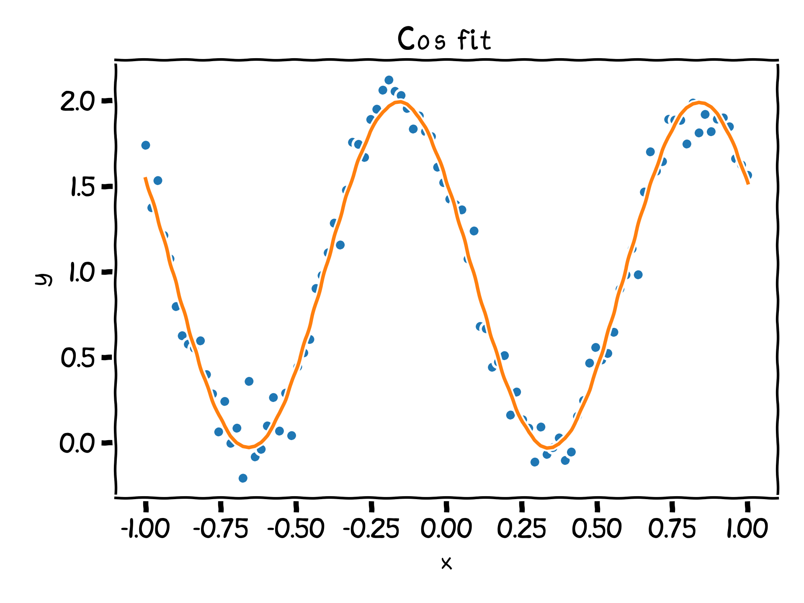
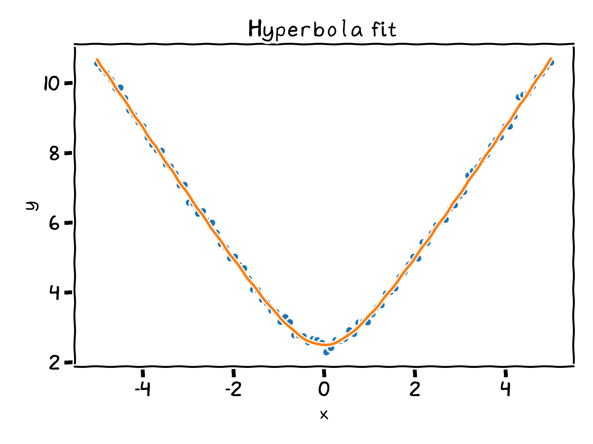
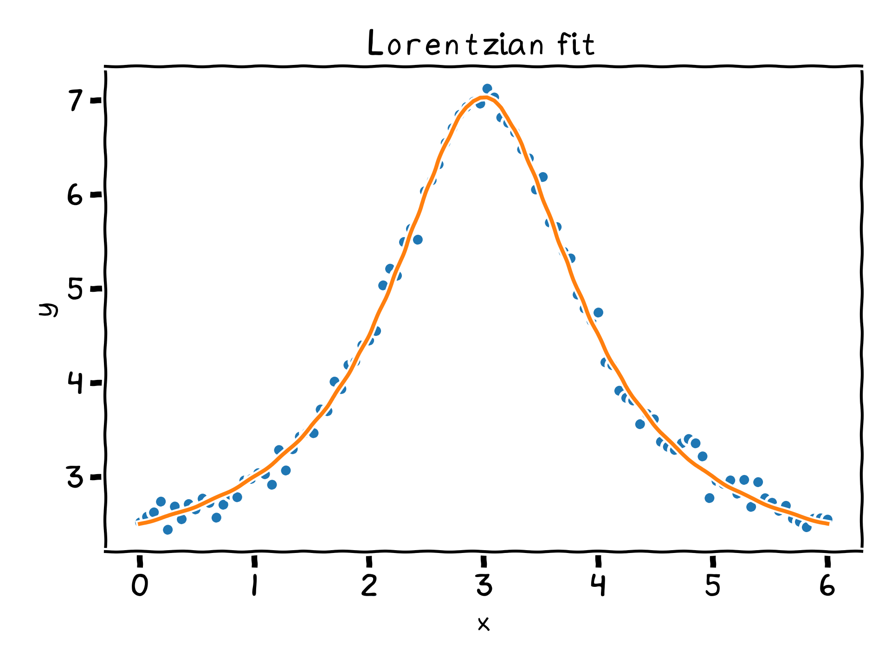
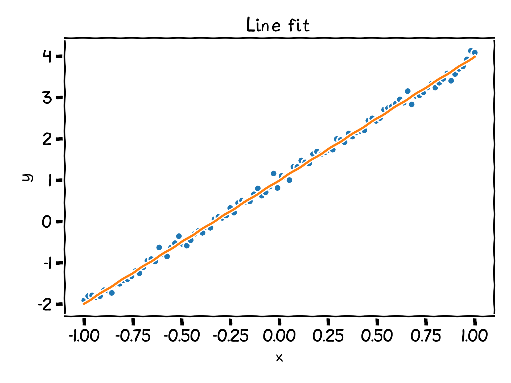
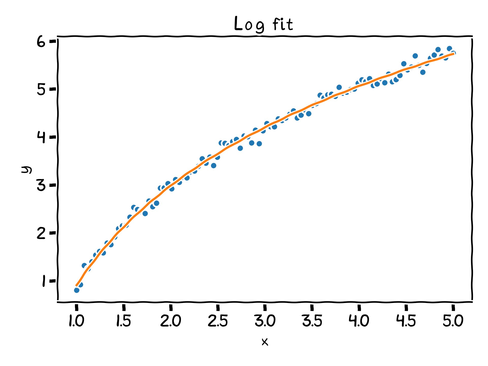

# Implemented functions

Here is a list of the all implemented functions:

## [Cosine](cos.md)

## [Hyperbola](hyperbola.md)

## [Lorentzian](lorentzian.md)

## [Exp](exp.md)

## [Line](line.md)

## [Log](log.md)

